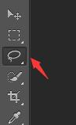
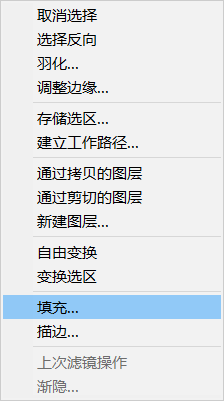
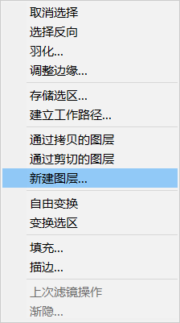
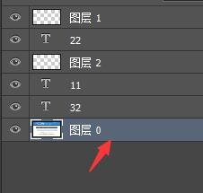

用PS修改图片日期方法如下。
•第一步:打开图片,选择左侧“多边形套索工具”。

•第二步:用多边形套索工具选中要修改的地方,然后单击右键,在弹出的菜单中选择“填充”。

•第三步:在“填充”窗口中下拉菜单,选择“内容识别”,然后点击确定。
•第四步:确定之后,我们可以看到数字“16”已经被消除。
•第五步:用文字工具插入数字“15”。
第六步：多处修改需要先新建图层，然后选则该图层再执行上面的操作

