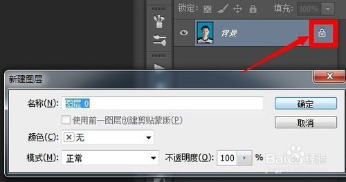
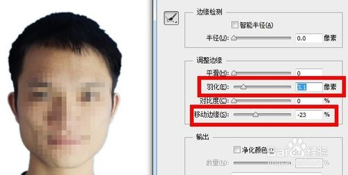

# 用ps换证件照背景颜色 #

## 1、先打开一张证件照，双击图层锁解锁 ##

## 2、点击快速选择工具 ##

## 3、按住鼠标在证件照背景上涂抹，这时出现了一个虚线框，尽量使虚线框框住人物轮廓 ##

## 4、如果不小心涂抹到人物轮廓内侧，也就是虚线框跑得人脸上了，就按住键盘上的alt键，按住鼠标把虚线框推出到人物轮廓边缘 ##

## 5、人物框选完之后，点击上方菜单栏的选择——反向 ##

## 6、这时，虚线框，选中的才是人物，点击调整边缘，调整羽化值的大小，使人物轮廓更平滑，如果轮廓边缘出现了背景色线条，就把移动边缘的滑块往左移动一点点~边缘调整过程中可以在画布中看到实际效果，调到合适位置后，点击确定 ##

## 7、然后按住键盘上的ctrl+C复制和ctrl+V粘贴，把人物粘贴到新的图层上 ##

## 8、点击图层下方的新建图层按钮，新建一个图层，把新建的图层拖到复制出来发人物图层下方 ##

## 9、点击工具栏的油漆(如果没有油漆，可以右键渐变工具)，可以在下方的设置前景色按钮，选择一种颜色，这里选择了红色，然后在画布上点一下，这时，人物背景颜色被换成红色啦~ ##

